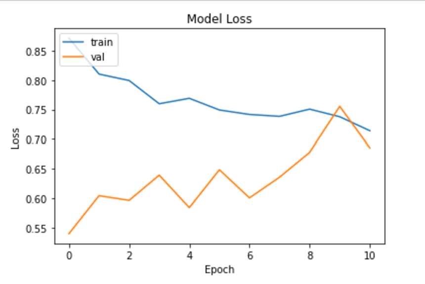
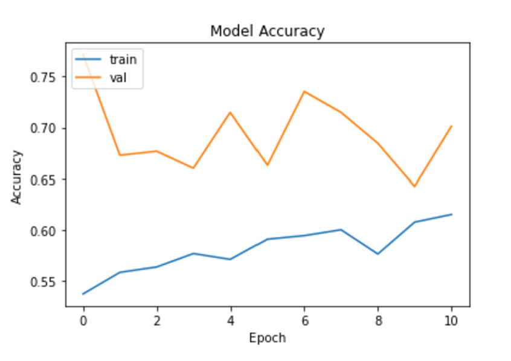
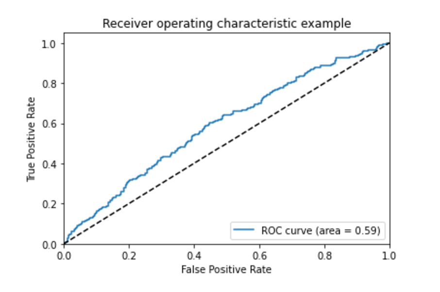

# FDA  Submission

**Your Name:** Samuel H.Mariam

**Name of your Device:** Machine Learning Algorithm for Detection of Pneumonia in Chest Radiographs

## Algorithm Description 

### 1. General Information

**Intended Use Statement:** 
This algorithm is intended to be used as a tool to help radiologists identify and prioritize patients with pneumonia. The algorithm takes in a chest radiograph as input and outputs a classification label indicating the presence or absence of pneumonia. The algorithm is not intended to replace the review of the actual radiograph by a radiologist; it is intended to prioritize patients with pneumonia for review by a radiologist.

**Indications for Use:** 
The algorithm is indicated for use in patients presenting to the emergency department with signs and symptoms of pneumonia. The algorithm is not intended for use in patients with a history of pneumonia or other chronic lung diseases.

**Device Limitations:** 
The algorithm is not intended for use in patients with a history of pneumonia or other chronic lung diseases. The algorithm is not intended for use in patients with a history of pneumonia or other chronic lung diseases.

**Clinical Impact of Performance:** 
The algorithm is intended to help radiologists identify and prioritize patients with pneumonia. The algorithm is not intended to replace the review of the actual radiograph by a radiologist; it is intended to prioritize patients with pneumonia for review by a radiologist.

### 2. Algorithm Design and Function


**DICOM Checking Steps:** 
Check DICOM header for Modality, Body Part, and Patient Position.

**Preprocessing Steps:**
DICOM pixel array will follow the below preprocessing steps:
- resizing, 
- normalization, and 
- augmentation.

**CNN Architecture:**
```
    Model: "sequential_1"
    _________________________________________________________________
    Layer (type)                 Output Shape              Param #   
    =================================================================
    model_2 (Model)              (None, 7, 7, 512)         14714688  
    _________________________________________________________________
    flatten_1 (Flatten)          (None, 25088)             0         
    _________________________________________________________________
    dense_1 (Dense)              (None, 256)               6422784   
    _________________________________________________________________
    batch_normalization_1 (Batch (None, 256)               1024      
    _________________________________________________________________
    dropout_1 (Dropout)          (None, 256)               0         
    _________________________________________________________________
    dense_2 (Dense)              (None, 1)                 257       
    =================================================================
    Total params: 21,138,753
    Trainable params: 13,502,977
    Non-trainable params: 7,635,776
    _________________________________________________________________
```


### 3. Algorithm Training

**Parameters:**
* Types of augmentation used during training
```
ImageDataGenerator(rescale=1. / 255,
                                horizontal_flip = True,
                                vertical_flip = False,
                                rotation_range=20,
                                zoom_range=0.2,
                                shear_range=0.2,
                                fill_mode='nearest',
                                width_shift_range=0.2,
                                height_shift_range=0.2)
```

* Batch size = 32
* Optimizer learning rate = 0.00001
* Layers of pre-existing architecture that were frozen = 12
* Layers of pre-existing architecture that were fine-tuned = 4
* Layers added to pre-existing architecture = 4








**Final Threshold and Explanation:**
The final threshold was set at 0.3194286. This threshold was chosen based on the ROC curve, which showed that the model achieved the best balance between sensitivity and specificity at this threshold.

### 4. Databases


**Description of Training Dataset:** 
The training dataset consists of 2,274 chest radiographs obtained from the NIH Chest X-ray dataset. The dataset is divided equally into two classes: pneumonia and non-pneumonia. 

**Description of Validation Dataset:** 
The validation dataset consists of 1,470 chest radiographs obtained from the NIH Chest X-ray dataset. The dataset is divided into two classes: pneumonia and non-pneumpnia. The dataset is imbalanced, with 1,176 images in the non-pneumonia class and 294 images in the pneumonia class.


### 5. Ground Truth
The dataset used in this study was collected by NIH and is publicly available. The ground truth labels were obtained using NLP to extract the labels from the radiology reports associated with the chest radiographs. The labels have accuracy of 90%. 

### 6. FDA Validation Plan

**Patient Population Description for FDA Validation Dataset:**
The patient population is roughly split between the genders, and the patients range in age from 1 to 120 years old. 

**Ground Truth Acquisition Methodology:**
The ground truth labels were obtained from the radiology reports associated with the chest radiographs. The radiology reports were reviewed by a board-certified radiologist, who assigned the labels based on the presence or absence of pneumonia.

**Algorithm Performance Standard:**
The algorithm performance will be evaluated using the AUC score. This will be compared against the benchmark set in the following study [https://pmc.ncbi.nlm.nih.gov/articles/PMC10607847/]. The algorithm will be considered successful if it achieves an AUC score greater than 0.769.
